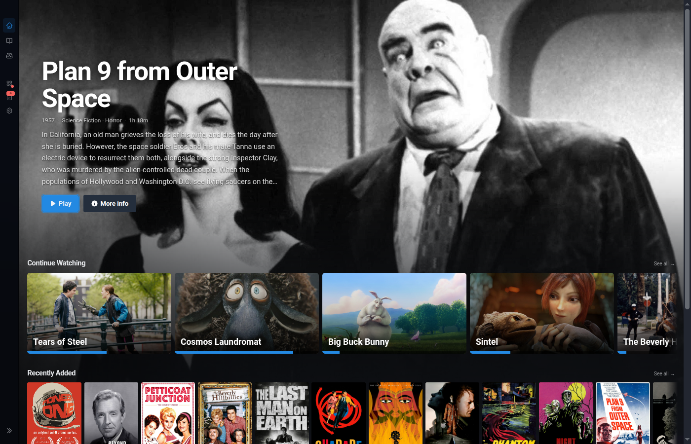
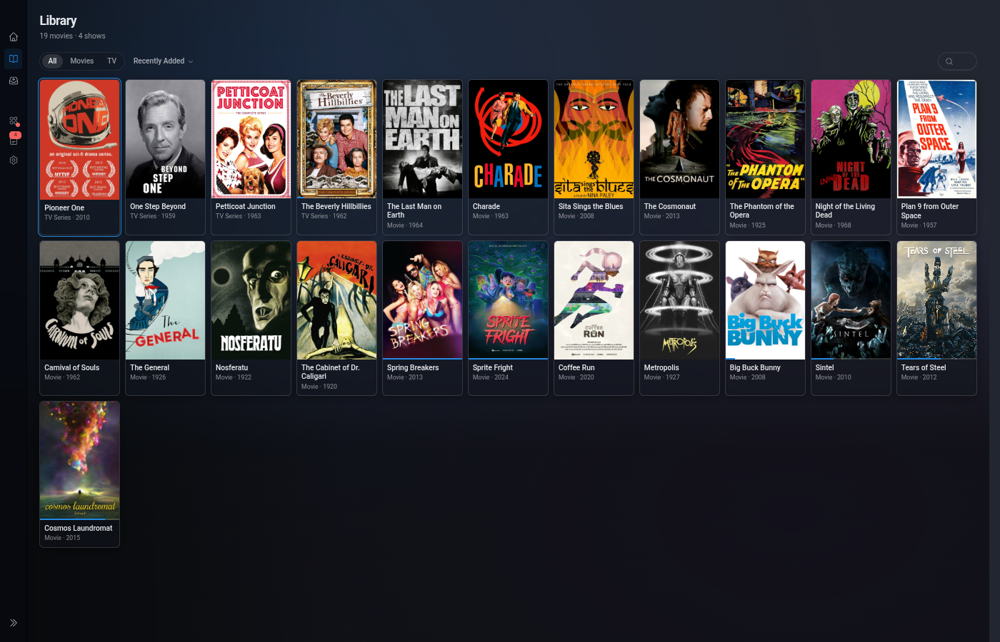
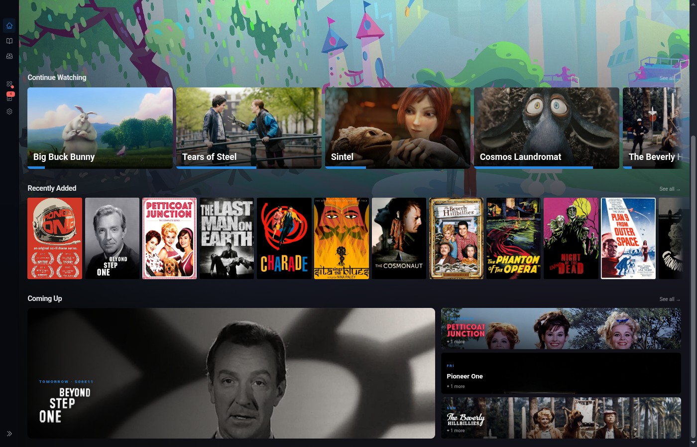
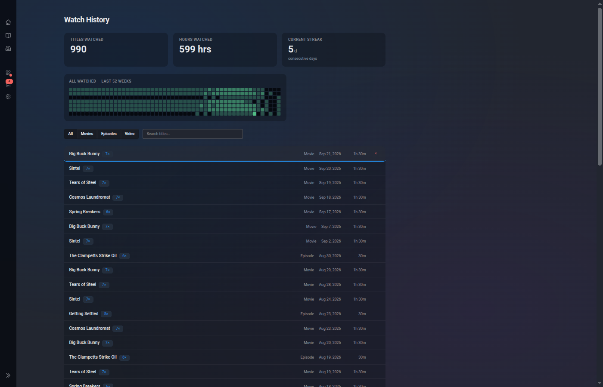
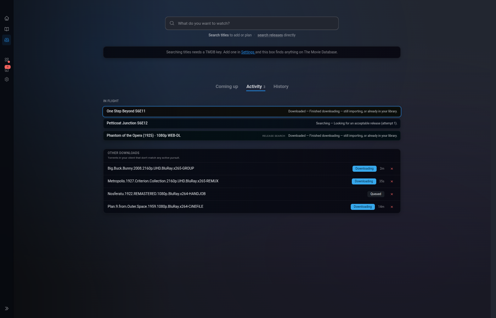

<div align="center">

<picture>
  <source media="(prefers-color-scheme: dark)" srcset="https://raw.githubusercontent.com/media-centaur/media-centaur/main/priv/static/images/centaur-logo-light.png">
  
</picture>

# Media Centaur

**Library management and playback for your personal movie and TV collection — the \*ARR stack and a couch-ready player in one self-hosted Linux app.**

 

Point it at your video directories. It identifies your movies and TV shows via TMDB, downloads artwork, tracks your progress, and plays everything locally through mpv — all from a real-time browser UI that's fast at your desk and made for your couch.

Zero-config SQLite. No Docker. No transcoding server. No accounts. No cloud.

**🌐 [Visit the site](https://media-centaur.github.io/media-centaur/) &nbsp;·&nbsp; 📖 [Read the docs](https://github.com/media-centaur/media-centaur/wiki)**

</div>

> [!NOTE]
> **Pre-1.0 and actively developed.** Functional for daily use; expect the occasional rough edge or breaking change between releases.

> [!NOTE]
> **UI overhaul in progress.** A complete pass over the visual design is shipping page by page. Every page is fully operational throughout — we're raising the bar on craft, not gating anything behind the rebuild.
>
> | Page              | Status        |
> | ----------------- | ------------- |
> | Home              | **Done**      |
> | Library           | **Done**      |
> | Release tracking  | In progress   |
> | Acquisition       | In progress   |
> | Dashboard         | In progress   |
> | Review            | In progress   |
> | Settings          | In progress   |

> [!IMPORTANT]
> **macOS support — experimental (Apple Silicon).** The Mac build now ships: the one-line installer works on Apple Silicon, autostart runs via launchd, and in-app updates work the same as on Linux. **Linux remains the fully-supported, primary platform.**
>
> Because we don't own Mac hardware, the macOS path is Linux-developer-tested only — so it's genuinely experimental and we need real-world reports. If you run it on macOS, please [open a `[macOS]` issue](https://github.com/media-centaur/media-centaur/issues/new?labels=macos) for anything that doesn't work. See the wiki's **[macOS](https://github.com/media-centaur/media-centaur/wiki/macOS)** page for install steps and the honest done/not-done list.

---

<div align="center">

<a href="https://cdn.jsdelivr.net/gh/media-centaur/media-centaur-assets@main/screenshots/home.png"></a>
<a href="https://cdn.jsdelivr.net/gh/media-centaur/media-centaur-assets@main/screenshots/library-grid.png"></a>

<a href="https://cdn.jsdelivr.net/gh/media-centaur/media-centaur-assets@main/screenshots/library-detail-movie.png"></a>
<a href="https://cdn.jsdelivr.net/gh/media-centaur/media-centaur-assets@main/screenshots/home-coming-up.png"></a>

<a href="https://cdn.jsdelivr.net/gh/media-centaur/media-centaur-assets@main/screenshots/upcoming-calendar.png"></a>
<a href="https://cdn.jsdelivr.net/gh/media-centaur/media-centaur-assets@main/screenshots/history-heatmap.png"></a>

<a href="https://cdn.jsdelivr.net/gh/media-centaur/media-centaur-assets@main/screenshots/download-activity.png"></a>

</div>

---

## What it does

- **Library management** — watches your directories for new video files, identifies movies and TV shows via TMDB, and downloads artwork automatically. Low-confidence matches wait for manual review instead of polluting your library with wrong guesses.
- **Playback** — launches mpv on the local machine, tracks your progress, resumes where you left off, and auto-advances to the next episode.
- **Release tracking** — monitors TMDB daily for upcoming movies and new TV seasons tied to the shows in your library.
- **Acquisition** *(optional)* — search and queue downloads via Prowlarr. Entirely optional: Media Centaur is a full library manager without it.
- **Couch-first UI** — keyboard *and* gamepad navigation, large artwork, dark-first. Built to drive a TV from across the room.
- **Real-time** — every change (new file, metadata fetched, playback started) appears instantly via Phoenix LiveView. No polling, no refresh.

## Non-goals

Media Centaur is deliberately **not** a streaming server or cross-platform media suite. It does not stream to remote devices, transcode, run in Docker, or support multiple users. If you need those, [Jellyfin](https://jellyfin.org/) and Plex do them well.

See the [FAQ](https://github.com/media-centaur/media-centaur/wiki/FAQ) for the full list and reasoning.

---

## Install

```sh
curl -fsSL https://raw.githubusercontent.com/media-centaur/media-centaur/main/installer/install.sh | sh
```

Downloads the latest release, verifies its checksum, installs atomically under `~/.local/lib/media-centaur/`, generates a `SECRET_KEY_BASE`, and sets up a systemd user unit. **The installer is idempotent** — re-run it any time to reset to the latest stable build, recover from a half-applied update, or roll a wedged install forward. Your config, data, and cache live elsewhere and are preserved.

After install, everyday updates happen inside the app: **Settings → System → Update now**.

Full installation guide and recovery playbook: **[Wiki → Installation](https://github.com/media-centaur/media-centaur/wiki/Installation)** · **[Wiki → Troubleshooting](https://github.com/media-centaur/media-centaur/wiki/Troubleshooting#reset-by-re-running-the-installer)**.

## Requirements

- SQLite3, mpv, inotify-tools
- A free [TMDB API key](https://www.themoviedb.org/settings/api)

**Arch:** `sudo pacman -S sqlite mpv inotify-tools` &nbsp;·&nbsp; **Debian/Ubuntu:** `sudo apt install sqlite3 mpv inotify-tools`

---

## Documentation

All end-user documentation lives in the **[Wiki](https://github.com/media-centaur/media-centaur/wiki)**:

- [Getting Started](https://github.com/media-centaur/media-centaur/wiki) — install, first run, add your library
- [Using Media Centaur](https://github.com/media-centaur/media-centaur/wiki) — browsing, playback, keyboard & gamepad, review queue
- [Setup Guides](https://github.com/media-centaur/media-centaur/wiki) — TMDB, Prowlarr, backup & restore, running as a service
- [Reference](https://github.com/media-centaur/media-centaur/wiki) — settings, FAQ, troubleshooting

---

## For contributors

```bash
git clone https://github.com/media-centaur/media-centaur.git
cd media-centaur
mix setup
mix phx.server
```

Architecture, pipeline internals, input system, and other developer documentation live in [`docs/`](docs/) and [`AGENTS.md`](AGENTS.md). Decision records are in [`decisions/`](decisions/).

---

## License

[MIT](LICENSE) — Copyright (c) 2026 Shawn McCool

## Acknowledgments

<a href="https://www.themoviedb.org">
  
</a>

This product uses the TMDB API but is not endorsed or certified by TMDB.
