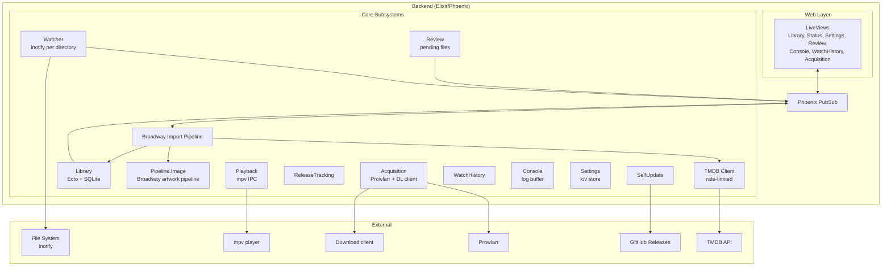
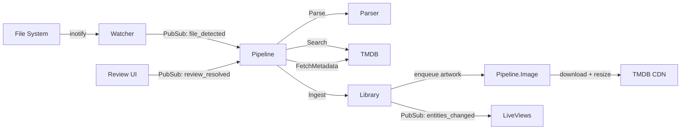

# Architecture

Media Centaur Backend is a Phoenix/Elixir application that watches directories for video files, enriches them with TMDB metadata and artwork, and serves the library through a LiveView web UI.

> **Architecture** · [Watcher](watcher.md) · [Pipeline](pipeline.md) · [TMDB](tmdb.md) · [Playback](playback.md) · [Library](library.md) · [Input System](input-system.md)

- [System Overview](#system-overview)
- [Bounded Contexts](#bounded-contexts)
- [Data Flow](#data-flow)
- [Supervision Tree](#supervision-tree)
- [PubSub Topics](#pubsub-topics)
- [Key Principles](#key-principles)
- [Specifications](#specifications)
- [Module Reference](#module-reference)

## System Overview

## Bounded Contexts

The backend is organised into the bounded contexts below plus a TMDB adapter, all enforced at compile time by the [Boundary](https://hex.pm/packages/boundary) library. Read the `use Boundary` declaration at the top of each context's facade module for the canonical inter-context dependency list.

| Context | Owns | Notes |
|---------|------|-------|
| `MediaCentaur.Library` | `library_*` tables, entity facade, file-presence ownership (FilePresence + AbsenceSweeper, per ADR-045) | Type-specific schemas: Movie, TVSeries, MovieSeries, VideoObject, Season, Episode, Extra, Image, Identifier, WatchProgress, WatchedFile, ExtraFile, FilePresence. |
| `MediaCentaur.Pipeline` | `pipeline_*` tables, Broadway import + image pipelines | Mediator that orchestrates parse → search → fetch → ingest. ETS-backed in-flight set in `Pipeline.Discovery.InflightSet` dedupes duplicate file-detected events — file discovery in the pipeline, unrelated to the `MediaCentaur.Discovery` context below. |
| `MediaCentaur.Review` | `review_*` table | Holds low-confidence matches awaiting human decision. |
| `MediaCentaur.Watcher` | inotify supervision + filesystem observer, drive-mount detection, exclude-dir handling | No DB tables — pure filesystem observer that emits `{:file_detected, ...}` events. Library owns the presence record (ADR-045). |
| `MediaCentaur.Settings` | `settings_*` table (key/value entries) | Shared infrastructure: any context may write its own keys via a declared `Settings` dep. |
| `MediaCentaur.ReleaseTracking` | `release_tracking_*` tables | Periodic TMDB refresh of upcoming items in the user's library. |
| `MediaCentaur.Discovery` | `watchlist_items` table | The local watchlist — title-level "I want to watch this" intent — and, in later iterations, the candidate sources that feed it (TMDB discover, list import, friend recommendations). Broadcasts on `discovery:updates`. |
| `MediaCentaur.Friends` | `relays` + `friends` tables, this install's Nostr identity in the sensitive `nostr_secret_key` config key, one live `Nostr.Connection` per relay | The friend network's configuration: `Friends.Identity` (one secp256k1 keypair, generated the first time the Friends tab is opened), `Relay`, `Friend`, and `Connections` (Registry + DynamicSupervisor + owner). Broadcasts on `friends:updates`, and re-broadcasts every connection's messages on `friends:connections`. See [docs/friends.md](friends.md). |
| `MediaCentaur.Recommendations` | `recommendations` table | What this install sent its friends and what they sent it: kind-32160 events translated into rows (`Translation`), kept one per author + title, synced with the relays by `Recommendations.Sync`. Knows nothing about the watchlist or the library — the web layer joins those. Broadcasts on `recommendations:updates`. See [docs/friends.md](friends.md). |
| `MediaCentaur.Playback` | mpv session supervision, progress broadcasts | No DB tables — in-memory sessions. |
| `MediaCentaur.Console` | `console_*` (filter/buffer-cap settings) + in-memory ring buffer + journal source | Drives the `/console` page and the Guake-style drawer. |
| `MediaCentaur.Acquisition` | `acquisition_*` tables, Prowlarr + download-client drivers, Oban jobs. **Sub-namespace `Acquisition.Pursuits`** introduces a goal-level aggregate with append-only event log and a hybrid-autonomy decision pipeline (`Snapshot → Policy → Action → Command`); workers (`Pursuits.Watcher`, `Pursuits.IdentityVerifier`) orchestrate, commands execute. See [ADR-039](../decisions/architecture/2026-05-07-039-acquisition-pursuits.md). | Optional — gated by `MediaCentaur.Capabilities`. |
| `MediaCentaur.WatchHistory` | `watch_history_*` table | Append-only stream of playback events. Declared kept-forever via a `:forever` retention policy. |
| `MediaCentaur.SelfUpdate` | GitHub release polling, in-app updater | Disabled in dev. |
| `MediaCentaur.Retention` | `retention_runs` table, policy registry, daily `SweepJob` | Data-hygiene orchestrator. Contexts declare policies in `RetentionPolicies` provider modules registered under `:retention_policy_providers` (runtime-resolved IoC, same shape as `:diagnostics_contributors`), so contexts may depend on `Retention` to record runs without cycles. Policies + observed pruning surface per subsystem on `/status`. |
| `MediaCentaur.TMDB` | TMDB HTTP adapter + rate limiter | Cross-cutting adapter, not a bounded context owner. |
| `MediaCentaur.TmdbArtwork` | `{data_dir}/images/tmdb/` cache — temporary artwork for TMDB identities not (yet) in the library | Referenced tier of the artwork promotion ladder: entries are held alive by registered `HoldProvider`s (`:tmdb_artwork_hold_providers` — tracked items, non-terminal pursuits) and swept 7 days after last use once unheld. |
| `MediaCentaur.Capabilities` | Pure query layer over Settings | Predicates that gate features on a passing Test Connection. Reads `Settings`, owns no state. |
| `MediaCentaur.Settings.Controls` | Compile-time keybinding catalog + persisted overrides | Used by Settings → Controls UI. |
| `MediaCentaur.Downloads` | Download-client drivers (`qBittorrent`, `SABnzbd`) behind one `@behaviour`, queue monitor, client health | Two-slot model — see [docs/download-clients.md](download-clients.md). |
| `MediaCentaur.Search` | Indexer search providers (Prowlarr) + query expansion | Feeds Acquisition; gated by `Capabilities`. |
| `MediaCentaur.Subtitles` | `subtitles_*` table, embedded + sidecar track detection | Owned by Library's ingest path, read by Playback. |
| `MediaCentaur.Reconciliation` | `reconciliation_*` table, episode-mapping models | Resolves files whose season/episode claim disagrees with the library. |
| `MediaCentaur.ErrorReports` | `incidents` table, error buckets, public-issue submission | Drives the Status page's report modal. |
| `MediaCentaur.IntegrationHealth` | Per-integration `configured? × test_state` in ETS | Gates the Setup tour; no DB tables. |
| `MediaCentaur.Diagnostics` | Read-side aggregator over ErrorReports + Playback | Composition only, owns no state. |
| `MediaCentaur.Status` | Read-side aggregator for the Status page | Composition only, owns no state. |
| `MediaCentaur.Guide` | Markdown guide book rendering | Static content; no DB tables. |
| `MediaCentaur.Setup` | First-run tour state + probes | Reads Capabilities and IntegrationHealth. |
| `MediaCentaur.Apps` | `apps` table, app launcher (Steam discovery, fire-and-forget spawn), `{data_dir}/images/apps/` art cache | Uniform App rows filled by add-time importers; artwork is disk-as-ledger, same idiom as TmdbArtwork. Nav entry gated by the `show_apps` preference. |
| `MediaCentaur.Nostr` | Nostr protocol only: keys (`Keys`), NIP-01 events (`Event`), subscription filters (`Filter`), one relay WebSocket per URL (`Connection`, NIP-01 + NIP-42) | Pure protocol library — no context deps, no DB tables, no domain meaning. Crypto via `bitcoinex` (pure Elixir, no NIF). See [docs/friends.md](friends.md). |

## Data Flow

## Supervision Tree

```mermaid
graph TD
    App[MediaCentaur.Supervisor<br/>one_for_one]

    App --> Telemetry[Telemetry]
    App --> Repo[Repo<br/>SQLite]
    App --> Oban[Oban]
    App --> PubSub[Phoenix.PubSub]
    App --> ConsoleBuffer[Console.Buffer]
    App --> JournalSource[Console.JournalSource]
    App --> TaskSup[TaskSupervisor]
    App --> RateLimiter[TMDB.RateLimiter]
    App --> WatcherSup[Watcher.Supervisor]
    App --> Availability[Library.Availability]
    App --> PipelineSup[Pipeline.Supervisor]
    App --> ImagePipelineSup[Pipeline.Image.Supervisor]
    App --> InitTask[Init Services Task]
    App --> AbsenceSweeper[Library.AbsenceSweeper]
    App --> FileEvents[Library.FileEventHandler]
    App --> SelfUpdater[SelfUpdate.Updater]
    App --> Listeners[PubSub listeners<br/>Inbound, Intake, Refresher,<br/>Recorder, Acquisition]
    App --> PlaybackSup[Playback.Supervisor]
    App --> Endpoint[Phoenix Endpoint]

    WatcherSup --> Registry[Watcher.Registry]
    WatcherSup --> DynSup[DynamicSupervisor]
    DynSup --> W1[Watcher per dir]

    ImagePipelineSup --> ImageStats[Pipeline.Image.Stats]
    ImagePipelineSup --> ImageRetry[Pipeline.Image.RetryScheduler]
    ImagePipelineSup --> ImageBroadway[Pipeline.Image<br/>Broadway]

    PlaybackSup --> SessionRegistry[SessionRegistry]
    PlaybackSup --> SessionSup[SessionSupervisor]
    SessionSup --> MpvSession[MpvSession per file]
```

PubSub listener GenServers (`Library.Inbound`, `Review.Intake`, `ReleaseTracking.Refresher`, `WatchHistory.Recorder`, `Acquisition`) are skipped in `:test` env — tests call the public functions directly. Watchers and the pipelines start in disabled state in tests; production toggles them via `services:<env>:start_watchers` / `start_pipeline` keys in `Settings`.

## PubSub Topics

The canonical taxonomy — every topic, its owning context, and the message
shape it carries — lives in the `MediaCentaur.Topics` moduledoc
(`lib/media_centaur/topics.ex`), next to the functions that produce the
strings. It is deliberately **not** duplicated here: this section used to
carry its own table and had drifted 13 topics behind the module, missing
the entire derived-views family that ADR-041 introduced.

Three roles in the taxonomy (see `MediaCentaur.Cache` for how they compose):

* **Source topics** carry canonical events about the truth
  (`library:updates`, `watch_history:events`, `playback:events`, …). Only
  the source-of-truth context broadcasts on these.
* **Derived topics** (`library:views`, `release_tracking:views`,
  `status:views`, `watch_history:views`) carry `{:*_view_updated, view_id}`
  after a projection rebuild. **LiveViews subscribe to derived topics,
  never to source topics for cache-driven data** (ADR-041).
* **Command topics** (`library:commands`) carry external write requests.

## Key Principles

- **Ecto is the data interface.** All persistence goes through context modules that wrap `Ecto.Repo` and broadcast `{:entities_changed, ids}` on `library:updates` for every mutation. Raw SQL is reserved for SQLite-specific features (e.g. `json_extract`).
- **Ecto schemas are the data spec.** Field names, types, and associations are defined in the schema modules under `lib/media_centaur/library/`. See [`specs/DATA-FORMAT.md`](../specs/DATA-FORMAT.md) for the entry shape returned to LiveViews.
- **UUIDs are permanent.** Entity IDs never change once assigned — they double as image directory names.
- **PubSub for cross-context communication.** Contexts don't call into each other's internals; cross-context wiring is enforced by Boundary.
- **Pipeline is a mediator.** The pipeline actively orchestrates — domain resources don't trigger pipeline behavior through state changes.
- **Capability gating.** UI surfaces that depend on TMDB / Prowlarr / the download client only appear once the integration's most recent Test Connection succeeded. See `MediaCentaur.Capabilities`.
- **Three-pillar state segregation.** Every state-bearing module belongs to exactly one of three pillars: long-term durable storage (DB), short-term in-memory state (ETS / `:persistent_term` / GenServer), or real-time PubSub coordination. LiveView read paths go through Pillar-2 projections that subscribe to source topics, refresh in-memory state, and emit derived `*_view_updated` broadcasts; LiveViews consume only the derived topics, never the DB on render. `MediaCentaur.Cache` is the unified container for the three Pillar-2 flavours; `Library.Progress.Worker` is the canonical GenServer-with-debounced-flush example. See [ADR-041](../decisions/architecture/2026-05-10-041-in-memory-projection-architecture.md).

## Specifications

Protocol specifications live in [`specs/`](../specs/):

| Spec | Governs |
|------|---------|
| [DATA-FORMAT.md](../specs/DATA-FORMAT.md) | Entity types, library entry shape, and pointer to the canonical Ecto schemas |
| [IMAGE-CACHING.md](../specs/IMAGE-CACHING.md) | Image storage conventions and the shared `MediaCentaur.ImageFiles` facade |

## Module Reference

| Module | Description | Path |
|--------|-------------|------|
| `MediaCentaur.Application` | OTP application, supervision tree | `lib/media_centaur/application.ex` |
| `MediaCentaur.Settings.Config` | Bootstrap TOML loader (`database_path`, `port`, `media_dirs` seed) + DB-backed runtime config | `lib/media_centaur/settings/config.ex` |
| `MediaCentaur.Topics` | Single source of truth for PubSub topic strings | `lib/media_centaur/topics.ex` |
| `MediaCentaur.Capabilities` | Predicates gating features on Test Connection results | `lib/media_centaur/capabilities.ex` |
| `MediaCentaur.Settings.Controls` | Keybinding catalog + persisted overrides | `lib/media_centaur/settings/controls.ex` |
| `MediaCentaur.ImageFiles` | Shared image download + libvips resize service | `lib/media_centaur/image_files.ex` |
| `MediaCentaur.Log` | Component-tagged thinking-log macros | `lib/media_centaur/log.ex` |
| `MediaCentaur.Storage` | Disk usage measurement | `lib/media_centaur/storage.ex` |
| `MediaCentaur.Maintenance` | Operator-driven destructive operations (clear DB, refresh image cache, repair missing images) | `lib/media_centaur/maintenance.ex` |
