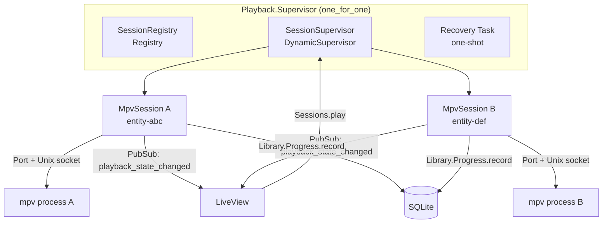
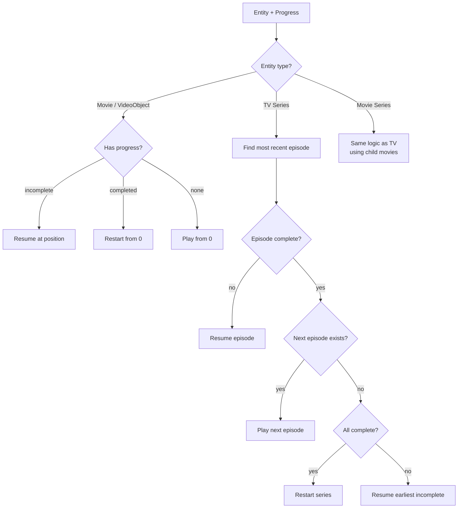

# Playback

End-user playback documentation has moved to the wiki:

- **[Playback](https://github.com/media-centaur/media-centaur/wiki/Playback)** — starting playback, resume logic, next-episode, multi-session.
- **[Keyboard & Gamepad](https://github.com/media-centaur/media-centaur/wiki/Keyboard-and-Gamepad)** — full input reference, including mpv controls.

---

## Contributor internals

The remainder of this file documents the Playback subsystem's internal architecture — MpvSession, session supervision, MPV IPC protocol, WatchingTracker, session recovery (ADR-023). This is developer-only content; end users should use the wiki links above.

### Architecture



### Key Concepts

**Multi-session playback:** Multiple mpv processes can run concurrently, one per entity. Each session is identified by its entity_id and uses an entity-scoped socket (`media-centaur-{entity_id}.sock`).

**Episode auto-advance ([ADR-062](../decisions/architecture/2026-08-18-062-playlist-based-episode-advance.md)):** a TV episode session is a *viewing chain*, not one file. The backend appends the successor episode to the mpv playlist (`Playback.NextEpisode`), so end-of-episode rolls into the next file inside the same mpv process — no window teardown, no HDR re-lock. The queueing decision runs off mpv's own `playlist-count`/`playlist-pos` observations (append only while the current entry is the last — reconnect-safe by construction), and a `path` change is the advance signal: the session closes out the finished episode, re-points its identity at the new file, and queues the next successor. The successor is always the *literally next* episode — a story-order gap (undownloaded episode) ends the chain rather than being skipped. Gated by the `auto_play_next_episode` setting (default on), read at each queueing decision. The in-player "Next Episode" pill during credits (`next-episode.lua`, contrib) is just `playlist-next`; the backend observes it like any other transition.

**Observation, not control:** The backend is a tracking system. The user controls mpv directly (keyboard, remote, gamepad). Each MpvSession observes position/duration/pause/eof via IPC, persists watch progress, and broadcasts state via PubSub.

**Seek-aware progress tracking:** The `WatchingTracker` distinguishes continuous watching from seeking. Progress is only saved during continuous playback (10+ uninterrupted seconds). Jumps > 3 seconds reset the continuous timer.

**Completion trigger:** whichever comes first — reaching a credits/outro chapter (a chapter titled "Credits"/"Outro" starting in the back 20% of the file, via `Playback.ChapterCompletion`) or 90% of duration for files without such a chapter. The chapter path lets titles with long credits tails complete at the true end of content instead of grinding to 90%. Completion is monotonic — once marked complete, it never regresses.

**Offline state:** `Library.Availability` tracks per-media-directory mount/reachability. When a file's media directory is unavailable, UI cards and the detail panel swap the **Play** button for a muted **Offline** indicator. The indicator clears automatically when availability restores — no LiveView reload needed.

**Error surfacing:** `MpvExitClassifier.classify/1` tells a normal end (`{:ok, :ended}` — mpv reported a property event before exiting) from a startup failure (`{:error, :startup_failure, message}`, the message built from the exit status and mpv's last stderr lines). MpvSession attaches the classification to the flash message the UI shows, and pipes mpv's full stderr through `ProgressBroadcaster` into the Console drawer (`:playback` filter) and the systemd journal for post-mortem inspection.

Because the production launch uses `--no-terminal` (which silences mpv's stderr entirely), the live port-data tail is usually empty. `MpvSession` adds `--log-file=<socket_dir>/media-centaur-<session_id>.log` to every spawn, and `MpvLogReader.fallback_tail/3` slurps the last 5 lines of that file when the port tail is empty — so the classifier always has the real mpv error string to summarise.

**Display-env resolution:** Before each spawn `DisplayEnv.resolve/1` builds the env list passed to `Port.open`. It prefers any `WAYLAND_DISPLAY` / `DISPLAY` already in the parent env, and falls back to scanning `$XDG_RUNTIME_DIR/wayland-N` (lowest N wins) and `/tmp/.X11-unix/XN` for live sockets. This protects against the common production failure where the systemd-user service started before the graphical session imported its env — without it, mpv aborts with status 1 and the classifier can only emit "mpv exited before playback started". When neither display server is reachable the session refuses to launch and broadcasts `PlaybackFailed{reason: :no_display}` so the UI can surface a clear message.

**Resume algorithm:** `Resume.resolve/2` determines what to play next:



### How It Works

#### Play Command

1. UI calls `Sessions.play/1` with an entity UUID
2. `Resolver.resolve/1` loads the entity and progress, then runs `Resume.resolve/2`
3. Sessions checks Registry for duplicates, then starts a new `MpvSession` via `SessionSupervisor`
4. MpvSession registers in `SessionRegistry` by entity_id
5. `DisplayEnv.resolve/1` builds the env list (WAYLAND_DISPLAY / DISPLAY, resolved from parent env or socket discovery); on `{:error, :no_display}` the session broadcasts `PlaybackFailed{reason: :no_display}` and stops
6. MpvSession launches mpv with `--input-ipc-server`, `--fullscreen`, `--log-file=<per-session-path>`, the resolved display env, and optional `--start=position`

#### MPV IPC Protocol

MpvSession communicates with mpv via newline-delimited JSON over a Unix domain socket:

**Commands sent:**
- `["observe_property", 1, "time-pos"]` — position tracking
- `["observe_property", 2, "duration"]` — total duration
- `["observe_property", 3, "pause"]` — pause state
- `["observe_property", 4, "eof-reached"]` — end of playlist (only fires at the final entry under `keep-open`)
- `["observe_property", 9, "playlist-count"]` / `[..., 10, "playlist-pos"]` — auto-advance queue check (ADR-062)
- `["observe_property", 11, "path"]` — playlist-advance detection
- `["loadfile", url, "append", -1, "start=N"]` — queue the successor episode (per-entry start; the index argument needs mpv ≥ 0.38)
- `["quit"]` — close player at playlist end

**Events received:**
- `property-change` for `time-pos`, `duration`, `pause`, `eof-reached`
- `end-file` with reason
- `shutdown`

#### Progress Persistence

| Event | Action |
|-------|--------|
| During active watching | Every position tick lands in memory via `Library.Progress.record/3`; `Library.Progress.Worker` flushes dirty rows every 5 s (`:library_progress_flush_interval_ms`) |
| On pause | Save immediately |
| On stop / EOF | Save immediately |
| During seeking | No save |

Each tick calls `Library.Progress.record/3` with the tracker's `saveable_position` (guards against seek corruption). At 90% completion, `mark_completed` is called (monotonic).

#### Progress Broadcasting

Every save broadcasts to `"playback:events"`:

```elixir
{:entity_progress_updated, %{
  entity_id: entity_id,
  summary: summary,
  resume_target: resume_target,
  changed_record: changed_record,
  last_activity_at: last_activity_at
}}
```

State changes broadcast with entity_id:

```elixir
{:playback_state_changed, %{entity_id: entity_id, state: state, now_playing: now_playing, started_at: started_at}}
```

Both payloads are `Playback.Events` structs (map-match them; MC0012 pins the contract).

#### Session Recovery (ADR-023)

On startup, a one-shot Task scans the socket directory for `media-centaur-*.sock` files. For each socket found, it probes mpv for the current path and position, resolves the entity, and starts a reconnecting MpvSession. Dead socket files are cleaned up.

#### WatchingTracker

Pure function module that gates progress persistence:

| Position Delta | Behavior |
|----------------|----------|
| <= 3 seconds | Continuous playback, accumulate time |
| > 3 seconds | Seek detected, reset continuous timer |

After 10 continuous seconds, `actively_watching` becomes `true` and `saveable_position` starts advancing.

#### Display Helpers

**ProgressSummary** — computes display-ready progress for UI cards:
- Current episode (season, episode)
- Position and duration
- Episodes completed vs. total

**ResumeTarget** — computes button hints for what plays on click:
- Action: `begin`, `resume`
- Target entity/episode/movie identifiers
- Per-child targets for series grid items

### Module Reference

| Module | Description | Path |
|--------|-------------|------|
| `MediaCentaur.Playback.Sessions` | Public API facade (stateless) | `lib/media_centaur/playback/sessions.ex` |
| `MediaCentaur.Playback.SessionRegistry` | Registry wrapper, entity_id lookup | `lib/media_centaur/playback/session_registry.ex` |
| `MediaCentaur.Playback.MpvSession` | Per-session GenServer, MPV IPC observer | `lib/media_centaur/playback/mpv_session.ex` |
| `MediaCentaur.Playback.SessionSupervisor` | DynamicSupervisor for sessions | `lib/media_centaur/playback/session_supervisor.ex` |
| `MediaCentaur.Playback.SessionRecovery` | Multi-socket orphan recovery | `lib/media_centaur/playback/session_recovery.ex` |
| `MediaCentaur.Playback.Supervisor` | Groups Registry + SessionSupervisor + Recovery | `lib/media_centaur/playback/supervisor.ex` |
| `MediaCentaur.Playback.Resume` | Resume/next algorithm | `lib/media_centaur/playback/resume.ex` |
| `MediaCentaur.Playback.Resolver` | UUID → play params | `lib/media_centaur/playback/resolver.ex` |
| `MediaCentaur.Library.EpisodeList` | TV episode walking helpers | `lib/media_centaur/library/episode_list.ex` |
| `MediaCentaur.Playback.NextEpisode` | Auto-advance successor resolution + path re-identification (ADR-062) | `lib/media_centaur/playback/next_episode.ex` |
| `MediaCentaur.Library.MovieList` | Movie series walking helpers | `lib/media_centaur/library/movie_list.ex` |
| `MediaCentaur.Playback.ProgressSummary` | Display-ready progress computation | `lib/media_centaur/playback/progress_summary.ex` |
| `MediaCentaur.Playback.ResumeTarget` | Play-button hint computation | `lib/media_centaur/playback/resume_target.ex` |
| `MediaCentaur.Playback.WatchingTracker` | Seek detection, continuous-watch gating | `lib/media_centaur/playback/watching_tracker.ex` |
| `MediaCentaur.Playback.MpvExitClassifier` | Tells a normal end from a startup failure, with the message for the latter | `lib/media_centaur/playback/mpv_exit_classifier.ex` |
| `MediaCentaur.Playback.MpvLogReader` | Tails the per-session `--log-file=` capture for the classifier | `lib/media_centaur/playback/mpv_log_reader.ex` |
| `MediaCentaur.Platform.DisplayEnv` | Resolves `WAYLAND_DISPLAY` / `DISPLAY` env for mpv spawn (OS-specific, so it lives under `Platform`) | `lib/media_centaur/platform/display_env.ex` |
| `MediaCentaur.Playback.ProgressBroadcaster` | Fan-out of progress + diagnostic output to PubSub and thinking logs | `lib/media_centaur/playback/progress_broadcaster.ex` |
