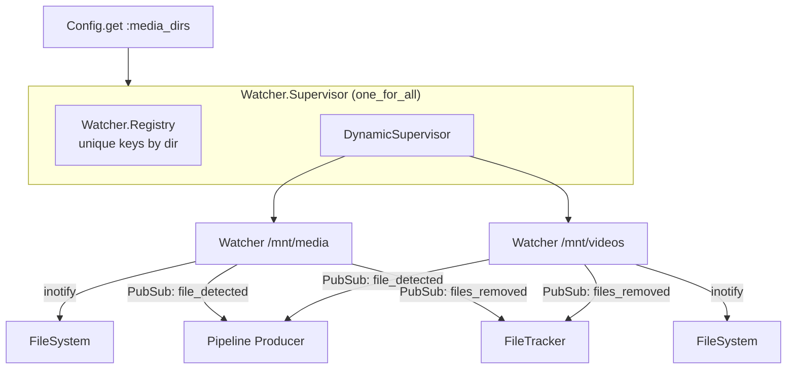
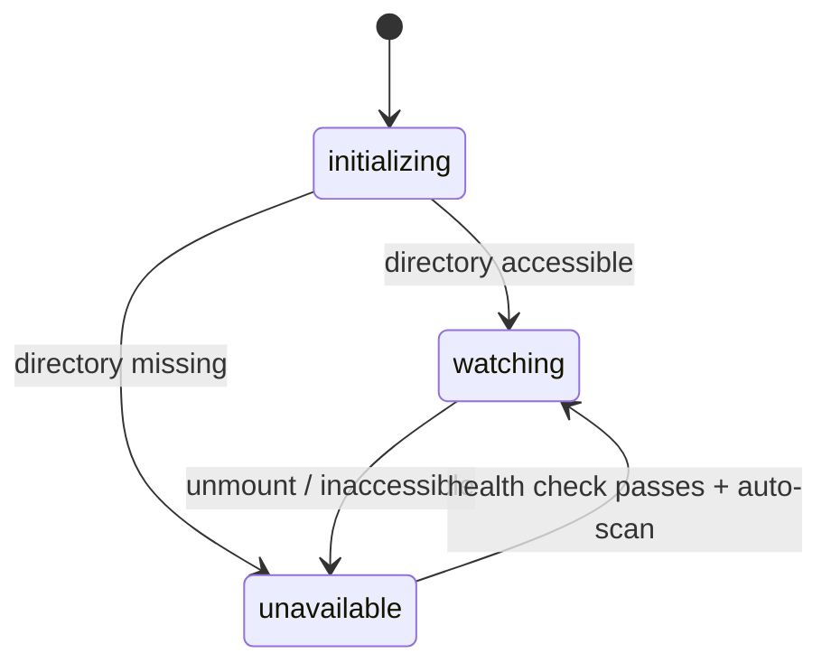

# Watcher

The watcher subsystem monitors configured directories for video file additions and removals using Linux inotify. One `Watcher` GenServer runs per directory, coordinated by a shared supervisor.

> [Architecture](architecture.md) · **Watcher** · [Pipeline](pipeline.md) · [TMDB](tmdb.md) · [Playback](playback.md) · [Library](library.md) · [Input System](input-system.md)

- [Architecture](#architecture)
- [Key Concepts](#key-concepts)
- [Configuration](#configuration)
- [How It Works](#how-it-works)
- [PubSub Events](#pubsub-events)
- [Module Reference](#module-reference)

## Architecture

## Key Concepts

**Supported video extensions:** `.mkv`, `.mp4`, `.avi`, `.mov`, `.wmv`, `.m4v`, `.ts`, `.m2ts`

**Watcher states:**

- `:initializing` — starting up, not yet watching
- `:watching` — inotify active, detecting files
- `:unavailable` — directory missing or unmounted (e.g., removable drive disconnected)

**File stability check:** When a file is created or modified, the watcher polls its size twice at 5-second intervals. Only after the size stabilizes is the file broadcast as detected. This handles in-progress downloads and copies.

**Deletion debouncing:** File removals are buffered with a 3-second sliding window. All deletions in the window are flushed together in one PubSub broadcast.

## Configuration

- `media_dirs` — directories to monitor (see [configuration.md](configuration.md))
- `exclude_dirs` — **path rules**: an absolute path, and everything under it, that is not library content
- `skip_dirs` — **name rules**: a directory name that is not library content wherever it appears

All three are DB-managed since v0.14.0 / v0.15.0 — edits happen in **Settings → Library** and flow through `Settings` to the watchers without a restart. The TOML holds only bootstrap state: `database_path`, `port`, and the initial `media_dirs` seed (imported once on first boot, managed in the UI thereafter).

### Ignore rules

`exclude_dirs` and `skip_dirs` are one idea with two matching modes — the same distinction gitignore draws between patterns with and without a slash — and they are compiled into one value by `Watcher.IgnoreRules`. `IgnoreRules.library_content?/2` is the single admission predicate: a recognised video extension, and no rule covering the path. Every boundary where a path enters the library asks it:

| Boundary | Call |
|---|---|
| inotify event (`Watcher.interesting?/2`) | `library_content?/2` |
| directory scan (`Watcher.Walk.walk/2`) | `ignored_dir?/2` to prune, then `library_content?/2` per file |
| recovery re-emit (`Watcher.Rescan.rescan_unlinked/0`) | `library_content?/2` |

`IgnoreRules.load/1` adds rules the user does not configure: `.staging` as a name rule (the download-client assembly contract), and the media directory's own image-cache and image-staging roots as path rules.

**Invariant: no linked file's path may sit under an ignore rule.** Settings rejects a rule that would cover imported titles, naming the count. Without it, ignoring such a directory would stop the scan re-stamping those `FilePresence` rows and `Library.AbsenceSweeper` would purge them — running the deletion cascade — once the absence TTL elapsed, for files still sitting on disk.

**Adding a rule retracts what is recorded under it.** Until 2026-09-15 a rule only filtered future work: rows already under it stayed, `rescan_unlinked/0` re-fed them to the pipeline on every boot (two TMDB searches each, for files that could never match), and their review-queue entries sat there for content the user had said was not library content. `Rescan.retract_ignored/0` reconciles the two, broadcasting `{:files_removed, paths}` — the one representation of "the library no longer has these paths", consumed by `Library.FileEventHandler` (presence rows) and `Review.FileEventHandler` (queue rows). Files on disk are untouched. An imported file under a rule is reported, never retracted.

### Runtime config updates

When media dirs or ignore rules change, `Settings` broadcasts `:config_updated` on the `config:updates` topic. Each running `Watcher` reloads its own cached rule set from that broadcast, in place — no supervisor restart, no inotify teardown. This is what makes v0.21.0's "changes to your excluded-directory list take effect immediately" work; before 2026-09-15 only `exclude_dirs` refreshed, so a `skip_dirs` edit went unseen by the event filter until the next restart.

`Watcher.ConfigListener` handles the once-per-change, cross-directory halves: `media_dirs` reconciles the running watcher set, and either ignore-rule key runs `Rescan.retract_ignored/0`.

Media-dir edits reconcile the running set only while watching is on (`Watcher.Supervisor.enabled?/0`, flipped by `start_watchers/0` / `stop_watchers/0` — boot and the Settings toggle). With watchers off, an edit starts nothing; turning them back on reads the current dirs. Retraction is **not** gated that way: the rule was saved, so the database must match it either way.

The v0.21.0 crash fix lives in the same path: previously, creating or modifying an excluded directory could trip an unhandled message and kill the watcher; the handler now treats events for excluded paths as no-ops.

## How It Works

### File Detection

1. inotify reports a create/modify event for a file with a video extension
2. Watcher starts size stability polling (2 checks, 5 seconds apart)
3. Once stable, broadcasts `{:file_detected, %{path, media_dir}}` to `"pipeline:input"`
4. Pipeline Producer picks it up for processing

### File Removal

1. inotify reports a delete event
2. Path is buffered in the deletion queue
3. After 3 seconds with no new deletions, all buffered paths are flushed
4. Broadcasts `{:files_removed, [paths]}` to `"library:file_events"`
5. FileTracker handles cleanup

**UI-initiated deletions** bypass inotify entirely. `Library.Removal` calls `File.rm`/`File.rm_rf` and then invokes `FileTracker.cleanup_removed_files/1` directly. If the watcher's inotify also fires for the same paths (single-file deletes), the second cleanup is a no-op because `cleanup_removed_files` is idempotent. For folder deletions, `rm -rf` typically only generates a directory-level inotify event (not per-file), which the watcher ignores.

### Mount Recovery

1. Health check runs every 30 seconds
2. The watcher captures the path's device id (`{major_device, minor_device}` from `File.stat/1`) when it starts watching
3. Each tick re-stats the path and feeds the result through `Watcher.MountStatus.action/3`:
   - directory disappeared → transition to `:unavailable`
   - device id changed under `:watching` (drive mounted onto an existing empty mountpoint, or a different filesystem swapped in) → tear down the inotify watcher and re-init with `was_unavailable: true` so the recovery scan re-broadcasts entities for image re-resolution
   - directory accessible after `:unavailable` → re-init
4. Auto-scan runs after re-init to detect any files added while the directory was unavailable or while inotify was attached to a stale inode
5. State change broadcast to `"watcher:state"` PubSub topic

Why device-id tracking matters: inotify watches inodes, not paths. If a watcher attaches to an empty mountpoint at startup and a drive is mounted on top later, no inotify events ever fire — the watch is on the now-shadowed pre-mount inode. The device-id check is the only kernel-level signal that a remount happened.

### Manual Scan

The dashboard provides a "Scan directories" button that calls `Watcher.Rescan.scan/0`. This walks all watched directories recursively, detecting video files not yet tracked in the database. Each new file enters the pipeline normally.

## PubSub Events

| Topic | Event | Payload |
|-------|-------|---------|
| `pipeline:input` | `:file_detected` | `%{path: string, media_dir: string}` |
| `library:file_events` | `:files_removed` | `[path, ...]` |
| `watcher:state` | `:watcher_state_changed` | `{dir, new_state}` |

## Module Reference

| Module | Description | Path |
|--------|-------------|------|
| `MediaCentaur.Watcher` | Per-directory GenServer, inotify + PubSub. Stamps `Library.FilePresence` on detection; broadcasts `{:files_removed, paths}` on inotify delete | `lib/media_centaur/watcher.ex` |
| `MediaCentaur.Watcher.Supervisor` | Coordinates all watchers; start/stop/pause API, statuses | `lib/media_centaur/watcher/supervisor.ex` |
| `MediaCentaur.Watcher.Rescan` | On-demand `scan/0`, `rescan_unlinked/0` (walks `library_file_presences` for present-but-unlinked files) and `retract_ignored/0`, each with an `_async` form; `reconcile/0` is the boot pass that runs all three | `lib/media_centaur/watcher/rescan.ex` |
| `MediaCentaur.Watcher.ConfigListener` | Subscribes to `config:updates`; reconciles the watcher set on a media-dir change and retracts on an ignore-rule change | `lib/media_centaur/watcher/config_listener.ex` |
| `MediaCentaur.Watcher.IgnoreRules` | The rule set and the single `library_content?/2` admission predicate. Exported from the boundary — Settings validates a new rule against the same matcher | `lib/media_centaur/watcher/ignore_rules.ex` |
| `MediaCentaur.Watcher.Walk` | Recursive scan traversal; returns library content, pruning ignored directories | `lib/media_centaur/watcher/walk.ex` |
| `MediaCentaur.Watcher.DirMonitor` | Supervises image-dir availability monitors | `lib/media_centaur/watcher/dir_monitor.ex` |
| `MediaCentaur.Watcher.DirValidator` | Dialog-time path validation (exists / readable / not nested) | `lib/media_centaur/watcher/dir_validator.ex` |
| `MediaCentaur.Watcher.Reconciler` | Startup reconciliation against persisted state | `lib/media_centaur/watcher/reconciler.ex` |
| `MediaCentaur.Watcher.MountStatus` | Pure decision logic for the health check (device-id tracking) | `lib/media_centaur/watcher/mount_status.ex` |

> Presence storage and TTL purge moved out of `Watcher` in the library-presence-unification campaign (ADR-045). See `MediaCentaur.Library.FilePresence` and `MediaCentaur.Library.AbsenceSweeper`. The legacy `Watcher.KnownFile` / `Watcher.FilePresence` / `Watcher.AbsencePolicy` modules and the `watcher_files` table no longer exist.
